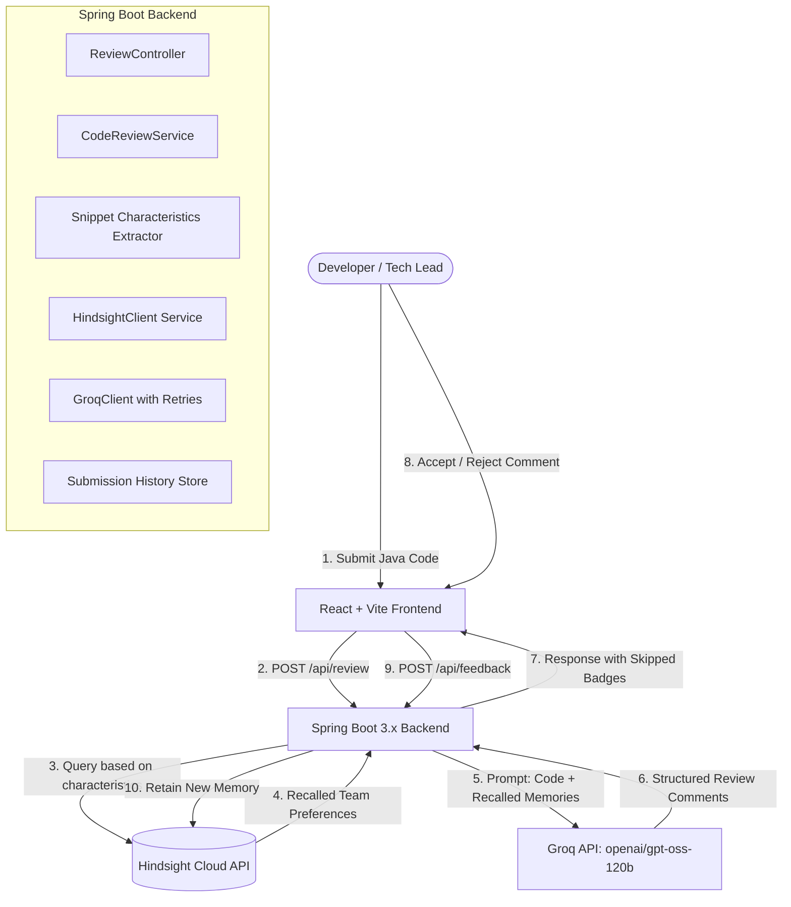

# AI Code Review Agent with Persistent Team Memory (Hindsight-Powered)

> **Hackathon Track:** AI Agents That Learn Using Hindsight  
> **Core Concept:** An intelligent Java code review agent that remembers team-specific feedback via Hindsight. Overridden recommendations become persistent team preferences so the agent never repeats refuted suggestions, while reinforced standards are maintained across future reviews.

---

## Architecture Overview



---

## Why Memory Must Be Visibly Central

In typical AI code reviewers, every review starts from scratch with zero memory of past team discussions. When developers reject an automated comment (e.g. *"Our team permits field injection for legacy modules"* or *"This collection is capped at 5, N+1 query is fine here"*), standard LLMs will flag the exact same code on the next PR.

**With Hindsight Integration:**
1. **Targeted Recall Before Prompting:** When a review request arrives at `POST /api/review`, the backend analyzes snippet characteristics (e.g., dependency injection style, exception handling, query patterns) and queries Hindsight Cloud for past decisions matching those patterns.
2. **Preference Injection & Suppression:** Recalled preferences are injected into Groq's system prompt with explicit instructions to mark matching issues as `skipped_known_preference`.
3. **Visibly Demonstrated in the UI:** Rather than silently vanishing, skipped items are prominently labeled in the UI as **`Skipped — team preference from [date]`** with the team's historical rationale displayed.
4. **Live Memory Dashboard:** Developers and leads can inspect all remembered team rules in real-time, filter between overridden vs enforced standards, and even proactively teach the agent new conventions.

---

## Tech Stack

| Layer | Technology | Purpose |
| :--- | :--- | :--- |
| **Backend** | Java 17, Spring Boot 3.3.4, Maven | High-performance REST API, orchestration, retry resilience |
| **Frontend** | React 19, Vite, Lucide React, Vanilla CSS | Interactive UI, live code preview, memory bank visualization |
| **Memory Engine** | **Hindsight Cloud REST API** (`hindsight.vectorize.io`) | Multi-strategy retrieval (semantic, keyword, graph, temporal), long-term agent memory |
| **LLM Inference** | **Groq API** (`openai/gpt-oss-120b`, fallback `qwen/qwen3-32b`) | High-speed chat completions with structured JSON response formats |
| **History Store** | In-Memory Concurrent Store | Tracks submission timeline and outcome evolution over time |

---

## Project Structure

```
ai-code-reviewer/
├── backend/
│   ├── pom.xml
│   ├── src/main/java/com/reviewer/
│   │   ├── AiCodeReviewerApplication.java       # Spring Boot main with .env loader
│   │   ├── config/
│   │   │   ├── AppProperties.java               # Config binding for Groq & Hindsight
│   │   │   └── CorsConfig.java                  # Cross-Origin resource sharing
│   │   ├── controller/
│   │   │   ├── ReviewController.java            # /api/review, /api/feedback, /api/memories, /api/submissions
│   │   │   └── DiagnosticController.java        # /api/diagnostic/health, isolated tests
│   │   ├── model/
│   │   │   ├── ReviewRequest.java               # { teamId, codeSnippet, language }
│   │   │   ├── ReviewResponse.java              # { reviewId, comments, recalledMemories, counts }
│   │   │   ├── ReviewComment.java               # { issue, severity, suggestion, skippedDueToMemory }
│   │   │   ├── FeedbackRequest.java             # { teamId, decision, rule, note }
│   │   │   ├── FeedbackResponse.java
│   │   │   ├── MemoryRecord.java                # For dashboard representation
│   │   │   └── SubmissionRecord.java            # For submission evolution tracking
│   │   └── service/
│   │       ├── HindsightClient.java             # Wraps retain, recall, listMemories with fallback
│   │       ├── GroqClient.java                  # Groq API with retries, model fallbacks, rule engine
│   │       ├── CodeReviewService.java           # Extracts characteristics, recalls memories, calls Groq
│   │       ├── FeedbackService.java             # Retains human decisions in Hindsight
│   │       └── SubmissionService.java           # Tracks historical review runs
│   └── src/test/java/com/reviewer/
│       ├── IsolatedClientTest.java              # Proves Hindsight & Groq in isolation
│       └── ReviewFlowIntegrationTest.java       # Validates end-to-end learning progression
├── frontend/
│   ├── index.html
│   ├── package.json
│   ├── vite.config.js
│   └── src/
│       ├── App.jsx                              # Root navigation & team state
│       ├── index.css                            # Glassmorphism dark design system
│       ├── components/
│       │   └── Navbar.jsx                       # Tab selector, team switcher, backend status
│       ├── pages/
│       │   ├── SubmitPage.jsx                   # Code editor, snippet loader, review cards, feedback
│       │   ├── MemoryDashboardPage.jsx          # Live Hindsight memory bank & proactive rule editor
│       │   └── HistoryPage.jsx                  # Submission timeline & evolution charts
│       ├── services/
│       │   └── api.js                           # Backend REST client
│       └── data/
│           └── syntheticSnippets.js             # 18 realistic Java scenarios across 6 categories
├── data/
│   └── synthetic-snippets.json                  # JSON dataset of Java code scenarios
├── scripts/
│   └── seed-demo.ps1                            # Automated 3-cycle learning progression runner
├── .env.example                                 # Sample environment variables
└── README.md
```

---

## Synthetic Java Dataset

The project includes **18 realistic Java code scenarios** covering 6 common design issues:
1. **Field Injection:** `@Autowired` on private non-final fields vs. constructor injection.
2. **N+1 Query Patterns:** Database queries called inside loops vs. batch fetching.
3. **Missing Null Checks:** Unchecked invocations on parameters or headers.
4. **Swallowed Exceptions:** Empty `catch` blocks hiding runtime failures.
5. **Magic Numbers:** Hardcoded integer constants without naming.
6. **Missing Try-With-Resources:** Unclosed `InputStream`, `BufferedReader`, or JDBC `Connection`.

Each snippet can be loaded into the UI editor with one click via the dropdown.

---

## Quickstart Guide

### 1. Prerequisites
- **Java 17+**
- **Apache Maven 3.8+**
- **Node.js 18+ & npm**

### 2. Configure Environment Variables
Copy `.env.example` to `.env`:
```bash
cp .env.example .env
```
Fill in your API keys (optional; the resilient engine operates gracefully even in offline/demo mode):
```ini
GROQ_API_KEY=gsk_your_groq_api_key_here
HINDSIGHT_API_KEY=hsk_your_hindsight_api_key_here
```

### 3. Run Backend
```bash
cd backend
mvn spring-boot:run
```
*Backend runs on `http://localhost:8080`*

### 4. Run Frontend
```bash
cd frontend
npm install
npm run dev
```
*Frontend runs on `http://127.0.0.1:5173`*

---

## Verification & Automated Tests

### Run Backend Unit & Integration Tests:
```bash
cd backend
mvn clean test
```
*Verifies isolated Hindsight write/recall, Groq client retry logic, and the complete 4-step end-to-end learning lifecycle.*

### Run Automated 3-Scenario Demo Seed Script:
```bash
powershell -ExecutionPolicy Bypass -File scripts\seed-demo.ps1
```
*Automatically runs 3 cycles of: (1) Baseline review flags issue -> (2) User rejects suggestion -> (3) Next review recalls memory and displays the **Skipped Due to Team Memory** badge.*

---

## 3-Minute Demo Script for Judges

1. **Open Frontend:** Navigate to `http://127.0.0.1:5173/`.
2. **Step 1 — Baseline Review:** 
   - On the **Submit & Review** tab, select `[Field Injection] Order Processing Service` from the dropdown.
   - Click **Review Code with Memory**.
   - Notice the review flags: *"Field injection (@Autowired on private fields) reduces testability"*.
3. **Step 2 — Teach the Agent:**
   - In the review card, enter note: *"Legacy order services use field injection as team convention"*.
   - Click **Reject & Remember**.
   - The card shows: *"Saved to Hindsight! Next review will skip this."*
4. **Step 3 — Inspect Memory Dashboard:**
   - Click **Memory Dashboard** in the top navigation.
   - See the newly saved preference stored in the team's Hindsight bank under **Overridden Rules**.
5. **Step 4 — Verify Memory Effect:**
   - Return to **Submit & Review** and click **Review Code with Memory** again.
   - **Result:** The Field Injection issue is now prominently badged with a purple glow:  
     **`Skipped - team preference: Field injection accepted for existing legacy services`**.
   - The banner shows **Recalled Team Preferences from Hindsight (1)**.
6. **Step 5 — Check History Evolution:**
   - Click **History** in the top navigation to see how review outcomes transformed over time as the agent adapted to the team's conventions.
